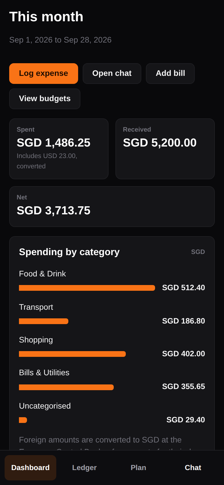
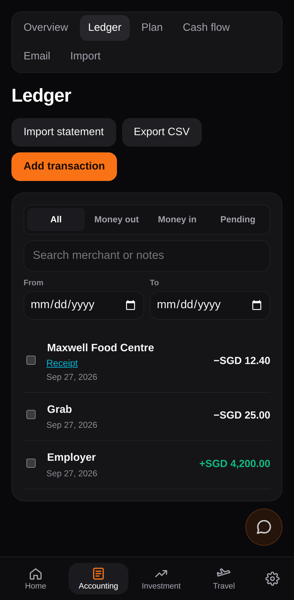
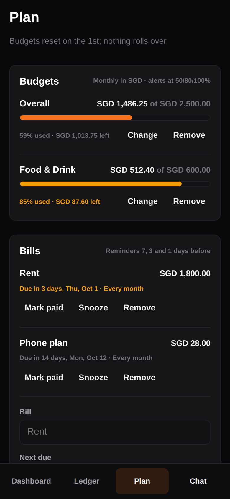
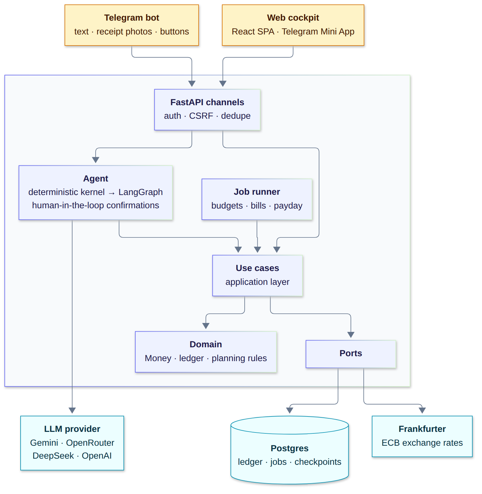

# Nexus Prime

[](https://github.com/benjamin-wo/nexus-prime/actions/workflows/ci.yml)


**A personal finance assistant you talk to.** Text the Telegram bot "lunch at Maxwell 8.40" or send it a receipt photo, and it's in your ledger. Open the web cockpit, on desktop or inside Telegram as a Mini App, to see where the month went. Budgets, bills and payday take care of themselves in the background.

One LLM agent serves both surfaces, but the parts that must be right, like money, identity and who can see what, never depend on the model.

<p align="center">
  
  
  
</p>
<p align="center"><sub>Screenshots use sample data.</sub></p>

## What it does

- **Capture in a sentence.**
  - "grab 12 yesterday", "coffee 5.50 USD", "split dinner 120 with Ann and Ben", "Ann paid me back 40".
  - Receipt photos are read by a vision model and logged after you confirm. The photo is kept privately with the expense.
  - Ask it to log automatically and it offers **Connect Gmail**, or for other mail (Outlook, iCloud, work) your own **forwarding address** with steps for a receipts-only rule. Receipts become Telegram questions (**Log it / Skip**), with an Email page showing what happened to each one.
- **Anything consequential asks first.** Edits, deletes, splits and budget removal show a Confirm / Cancel prompt. It survives restarts, because the conversation state lives in Postgres.
- **One currency view.**
  - Totals are in your home currency.
  - Each foreign-currency row shows its converted amount, the rate used and the day that rate was published.
  - An amount with no rate is flagged, never guessed.
- **Every expense has a category.** Twelve common ones to start (Dining Out, Groceries, Transport, Shopping, Bills & Utilities, Socialising, Health, Travel, Activities, Subscriptions & Software, Income, Other), and you can add, rename, archive or merge your own from chat or the Settings page (the cog in the nav). A category you name wins, then a rule, then the model's best guess; anything left goes to Other.
- **Category rules you can see.** "grab" → Transport files new expenses automatically, and "why is this in Transport?" gets a real answer. Correcting a category offers a rule change, but never makes one without asking.
- **Budgets:** monthly limits, overall or per category, with Telegram alerts at 50%, 80% and 100%, each sent once.
- **Bills:** reminders 7, 3 and 1 days before, with Mark paid and Snooze buttons. It never pays anything.
- **Subscriptions:** after three regular, similar charges from one merchant, Nexus asks whether to track it; tracked ones show on the Plan page with a monthly total, and a price change is flagged.
- **Cash flow:** a month calendar of net money movement per day: what was logged so far, and what bills, tracked subscriptions and payday are expected to bring. Movement only, never a balance. Also in chat: "what's coming up?"
- **Telegram updates:** by default, a summary of the day's spending at 9pm. Users can switch to updates as they happen, hourly, 3 times a day, or off, in chat or on the Settings page.
- **Payday:**
  - A check-in on payday, with weekend paydays moved to Friday.
  - Your usual salary changes only when you confirm it.
- **Web cockpit:** dashboard, filterable ledger, CSV export, IOUs, and a chat drawer with the same agent. It is mobile-first and opens inside Telegram already signed in.
- **Private by construction.** It is invite-only, and each user's data is isolated by the database schema itself, not just by application code.

## Architecture

<p align="center">
  
</p>

<sub>Source: [`docs/diagrams/architecture.mmd`](docs/diagrams/architecture.mmd). Regenerate with `npx @mermaid-js/mermaid-cli -i docs/diagrams/architecture.mmd -c docs/diagrams/mermaid-config.json -o docs/diagrams/architecture.png -s 2 -b white`.</sub>

The code follows a clean, layered architecture. `domain` holds pure rules with no I/O. `application` holds use cases that talk to storage only through ports. `infra` implements those ports. The agent, the channels and the job runner only ever call use cases. The tenant always comes from the authenticated principal: never from a request body, and never from the model's arguments.

## Engineering highlights

**Money is exact.**
- Amounts are `Decimal` in Python and `NUMERIC(19,4)` in Postgres, always stored with a currency, and currencies are never mixed.
- Splits allocate in minor units so they always sum back exactly.
- Foreign amounts convert at the rate published *on or before* the transaction's own local date. A later rate is never substituted, even if the provider returns one.

**Tenant isolation is enforced by the database.**
- Every child row references its parent by `(id, user_id)`, so Postgres itself rejects a cross-tenant link.
- Agent tools can't accept a `user_id`; any the model sends is dropped.
- Dedicated cross-tenant tests cover the ledger, IOUs, budgets, bills, salary, category rules, receipts, mailboxes and the web API, plus a test that the database itself rejects a cross-tenant link.

**The LLM is not trusted with the important parts.**
- A deterministic kernel runs before the model. It records plain income ("salary 5000", "Ann paid me back 20") exactly, handles stop/cancel, and refuses money movement ("transfer $500 to…") with a logged capability gap. Income worded any other way goes to the model, which records it only after the user confirms, and asks a short question first when the amount, kind or payer is unclear.
- Consequential tools pause the LangGraph run with `interrupt()` and wait for an explicit Confirm. The paused state is checkpointed in Postgres.
- Categorisation is explainable. Rules, not the model, file known merchants; each transaction records the rule that filed it, and a correction offers a rule change instead of making one.
- The model sits behind a provider-agnostic adapter with a fallback chain.

**Background jobs run exactly once, with no leader.**
- A Postgres job queue claims work with `FOR UPDATE SKIP LOCKED` under a lease.
- Recurring work is keyed per time slot, so two app instances overlapping during a deploy can't double-send an alert.
- Retries back off exponentially.
- Messages respect quiet hours in each user's timezone.

**Security fails closed.**
- Telegram Login and Mini App signatures are verified with HMAC.
- Invite and session tokens are stored only as hashes.
- Writes need an origin check plus a CSRF token.
- A strict CSP allows embedding only by Telegram's web client.
- Mailbox refresh tokens are encrypted at rest (Fernet, with key rotation); connecting uses a hashed one-time link that names the account it joins, and a replayed callback connects nothing.
- Receipts sit in a private bucket and are only reachable through 5-minute presigned links, handed out after an ownership check.
- Missing configuration stops startup instead of falling back.
- The repo is public, so no secret ever touches it.

**Idempotent everywhere.** Telegram updates, imports, alerts, reminders and payday logging all carry dedupe keys. A redelivered webhook or a double-tapped button is a no-op.

**It replaced a live system without losing data.** A read-only importer migrated the previous bot's history and verified per-user totals. The webhook moved over by a written runbook, and the old database was kept as an archive.

## Tech stack

| Layer | Choices |
|---|---|
| Backend | Python 3.12, FastAPI, SQLAlchemy 2 (async Core, asyncpg), Pydantic v2, Alembic |
| Agent | LangGraph with a Postgres checkpointer, human-in-the-loop interrupts, skills loaded on demand, provider-agnostic LLM adapter |
| Frontend | React 19, TypeScript, Vite, TanStack Query, React Router |
| Data | PostgreSQL 16: 22 tables, 10 migrations, a job queue in the same database; receipts in a private S3-compatible bucket |
| Channels | Telegram Bot API (webhook, inline buttons, Mini App), cookie sessions with CSRF |
| Quality | ruff, mypy `--strict`, pytest, Vitest, Playwright, GitHub Actions |
| Deploy | Docker multi-stage build on Railway; migrations run as a pre-deploy step and the app refuses to start on an unmigrated schema |

## Testing

Every change goes through the same CI: lint, format, strict type-checking, and three test suites.

- **330 Python tests.**
  - Unit tests cover pure rules: money arithmetic, budget thresholds at exact boundaries, due dates across short months and leap years, and paydays across weekends.
  - Integration tests run against a real Postgres, with a fresh database per test built by the real migrations.
  - A schema test fails if the migrations drift from the table definitions.
- **Agent tests** use a scripted fake model, so conversations, confirmations and refusals are deterministic.
- **Concurrency tests** race two job runners and assert each job runs exactly once.
- **Playwright journeys**, 19 of them, run on desktop and phone viewports. They include a check that nothing overflows a 320px screen.
- **Vitest** covers the components, including a regression test for a React effect-cleanup crash found in production.

## Project layout

```
src/nexus/
  domain/        pure rules: Money, ledger policies, budgets, bills, paydays
  application/   use cases (transactions, splits, budgets, bills, salary, FX, access) and ports
  infra/         Postgres repositories and unit of work, Frankfurter client, LLM factory
  agent/         kernel, LangGraph graph, tools, skills, service used by all channels
  channels/      Telegram webhook and client; web API, security, Mini App sign-in
  jobs/          job runner and handlers
  skills/        agent skills (expenses, budgets, bills, salary) as Markdown
web/             React cockpit, Vitest and Playwright tests
migrations/      Alembic revisions
tests/           unit and integration tests
docs/            build plan, operations guide, cutover runbook
```

## Running it

```bash
docker compose up -d db && cp .env.example .env
uv sync && uv run alembic upgrade head
uv run uvicorn --factory nexus.main:create_app --reload
```

The operations guide ([`docs/OPERATIONS.md`](docs/OPERATIONS.md)) covers the rest:
- configuration and the Telegram and web access model;
- background jobs;
- deployment;
- the full set of checks.

## Roadmap

The build follows [`docs/PLAN.md`](docs/PLAN.md). Each milestone ships to production as it lands.

- **Done:** foundations, ledger and agent, Telegram, the migration from the old bot, the web cockpit, multi-currency, the job runtime, budgets, bills, payday, category rules, the receipt archive, Connect Gmail and forwarding addresses, subscriptions and the cash-flow calendar.
- **Next:**
  - forwarding receipts from any mail provider;
  - recurring-spend and subscription detection;
  - a cash-flow calendar;
  - bank statement import (CSV, then PDF);
  - a hardening pass: security review, load tests and a restore drill.

See also [`CONTEXT.md`](CONTEXT.md) (glossary) and [`DESIGN.md`](DESIGN.md) (design system).
