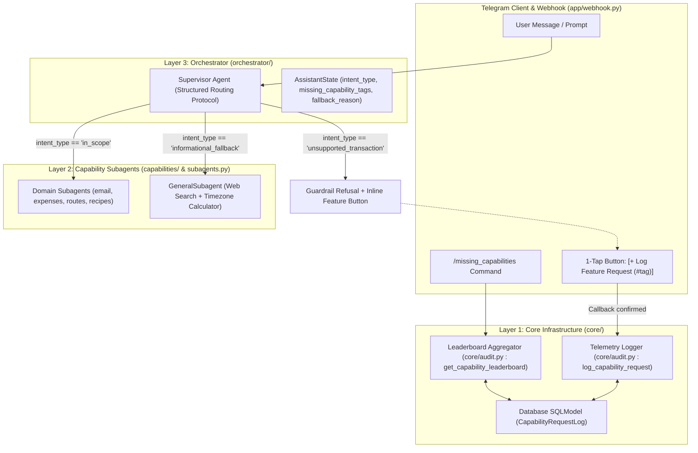
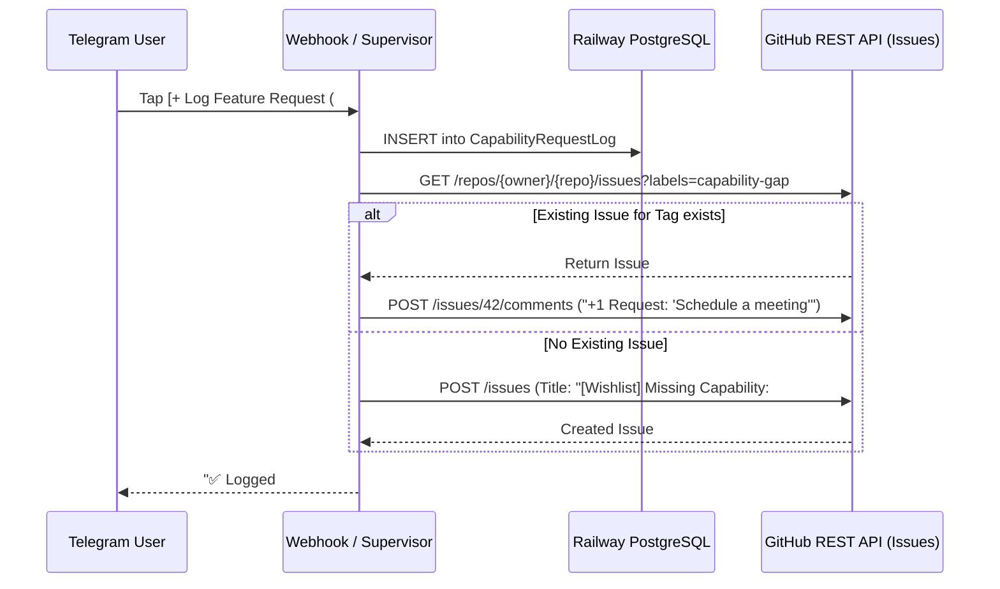

# Telegram Personal Assistant Bot — Capability-Gap Handling, Hybrid Fallback & Demand Telemetry Spec (RFC v2.0)

## 1. Overview & Architecture Scope

This document specifies the technical architecture for the **v2.0 Capability-Gap Handling & Open-World Task System** of the Railway-deployed **Personal Assistant Telegram Bot**. 

In v1.0, the bot operated under a closed-world domain model (`email`, `expenses`, `routes`, `recipes`). In v2.0, the bot introduces a **Hybrid Generalist Fallback** with a **Capability Demand Telemetry Loop**, enabling it to:
1. Gracefully answer open-world informational questions without rejecting harmless user prompts.
2. Strictly enforce transactional guardrails against unsupported actions.
3. Automatically record missing capability demand into a structured database log (`CapabilityRequestLog`) to drive data-informed engineering roadmaps for future releases.

---

## 2. Architecture & System Flow



---

## 3. Layer 1 — Core & Shared Infrastructure Specification (`core/`)

### 3.1 SQLModel Telemetry Schema (`core/models.py`)

A new table `CapabilityRequestLog` must be added to [core/models.py](file:///Users/benjaminwo/Documents/agent-learn/core/models.py) to persist missing capability demand:

```python
from datetime import datetime, timezone
from typing import Optional
from sqlmodel import Field, SQLModel

class CapabilityRequestLog(SQLModel, table=True):
    """
    Records unsupported task requests to generate a data-driven product roadmap.
    """
    id: Optional[int] = Field(default=None, primary_key=True)
    user_id: int = Field(index=True, description="Telegram user ID")
    requested_task: str = Field(description="Summary or raw text of user request")
    intent_type: str = Field(
        index=True, 
        description="'unsupported_transaction' or 'informational_fallback'"
    )
    missing_capability_tags: str = Field(
        index=True,
        description="Comma-separated or JSON string of tags (e.g., 'calendar,smart_home')"
    )
    created_at: datetime = Field(
        default_factory=lambda: datetime.now(timezone.utc),
        nullable=False,
    )
```

### 3.2 Telemetry Logging & Analytics Helpers (`core/audit.py`)

To keep all LLM-assisted audit and telemetry logging in one cohesive module, add the following helpers to [core/audit.py](file:///Users/benjaminwo/Documents/agent-learn/core/audit.py):

- `async def log_capability_request(user_id: int, requested_task: str, intent_type: str, tags: list[str]) -> CapabilityRequestLog`: Persists a new telemetry entry.
- `async def get_capability_leaderboard(limit: int = 10) -> list[dict]`: Aggregates records grouped by tag, counting frequency and returning sample user prompts.
- `async def sync_capability_gap_to_github_issue(tag: str, prompt: str, intent_type: str) -> Optional[str]`: Automatically creates or updates a GitHub Issue in the repository using the GitHub REST API.

### 3.3 GitHub Issues Integration & Automatic Roadmap Sync (`core/github_sync.py`)

To make missing capability requests immediately visible in standard developer workflows, the system supports **automatic GitHub Issues synchronization**:



#### Engineering Design:
1. **Environment Configuration**: Configured via optional env vars `GITHUB_TOKEN` (fine-grained PAT with `issues: write`) and `GITHUB_REPO="owner/agent-learn"`.
2. **Resilient DB-First Pattern**: Always writes to `CapabilityRequestLog` in PostgreSQL first. If `GITHUB_TOKEN` is unconfigured or the API times out, the local database log succeeds silently.
3. **Smart Deduplication**:
   - Before creating an issue, searches open issues tagged with label `capability-gap` matching the tag name (e.g., `#calendar`).
   - If an issue exists, appends a comment with the new sample prompt and increments an upvote counter.
   - If no issue exists, opens a new GitHub Issue tagged with `capability-gap`, `enhancement`, and `wishlist`.

---

## 4. Layer 2 — Capability & Fallback Specification (`orchestrator/subagents.py`)

### 4.1 Generalist Fallback Subagent (`general_subagent`)

A new subagent `general_subagent` must be added to [orchestrator/subagents.py](file:///Users/benjaminwo/Documents/agent-learn/orchestrator/subagents.py):

- **Purpose**: Answer factual, temporal, calculation, and general knowledge questions that do not require transactional domain plugins.
- **Tools**:
  - `search_web`: Lightweight DuckDuckGo/Tavily web search wrapper for live internet queries.
  - `get_current_time_in_user_tz(user_id)`: Calculates exact local time and date using `ZoneInfo` from `UserProfile`.
- **System Prompt Guardrail**:
  > *"You are the General Information Assistant. You answer factual and reasoning questions accurately. You MUST NEVER attempt to execute transactional actions, spend money, or pretend to control external systems. If asked for a transaction, state clearly that you lack the capability."*

---

## 5. Layer 3 — Orchestration & Intent Protocol Specification (`orchestrator/`)

### 5.1 State Schema Extension (`orchestrator/state.py`)

Extend `AssistantState` to carry intent classification metadata:

```python
class AssistantState(MessagesState):
    user_id: int
    intent_type: Optional[str] = None  # "in_scope", "informational_fallback", "unsupported_transaction"
    missing_capability_tags: Optional[list[str]] = None  # e.g., ["calendar"]
    fallback_reason: Optional[str] = None
```

### 5.2 Structured Routing Protocol (`orchestrator/supervisor.py`)

The supervisor must use a structured schema (`Pydantic` or `TypedDict`) for its routing decision:

```python
class SupervisorRoutingDecision(TypedDict):
    goto: Literal[
        "email", 
        "expenses", 
        "routes", 
        "recipes", 
        "general_subagent", 
        "FINISH"
    ]
    intent_type: Literal[
        "in_scope", 
        "informational_fallback", 
        "unsupported_transaction"
    ]
    missing_tags: list[str]
    reason: str
```

#### Routing Rules:
1. `in_scope` -> `goto` = selected domain subagent (`email`, `expenses`, `routes`, `recipes`).
2. `informational_fallback` -> `goto` = `"general_subagent"`.
3. `unsupported_transaction` -> `goto` = `"FINISH"`, and the supervisor writes a refusal message to state while attaching inline keyboard metadata.

---

## 6. Application & Webhook Layer Specification (`app/webhook.py`)

### 6.1 1-Tap Inline Refusal UX
When `intent_type == "unsupported_transaction"`, [app/webhook.py](file:///Users/benjaminwo/Documents/agent-learn/app/webhook.py) formats the Telegram response:
- **Text**: *"I don't currently have a capability plugin for that task. Here are the domains I can help you with: 📧 Email, 💰 Expenses, 🗺️ Routes, 🍳 Recipes."*
- **Inline Keyboard**: `[ + Log Feature Request (#tag) ]` (callback data: `log_req:<tag>:<summary_hash>`).
- **Callback Query Handler**: When the button is clicked, `webhook.py` calls `log_capability_request(...)` and edits the button message to: *"✅ Logged #tag to our feature wishlist!"*

### 6.2 Admin Analytics Command (`/missing_capabilities`)
When a user with admin privileges (or in single-tenant mode) types `/missing_capabilities`, `webhook.py` invokes `get_capability_leaderboard(limit=10)` and renders a Markdown leaderboard table:

```markdown
📊 **Top Missing Capability Requests**

| Rank | Tag | Requests | Sample Prompt |
| :---: | :--- | :---: | :--- |
| 1 | `#calendar` | 14 | *"Schedule a team meeting at 3pm"* |
| 2 | `#flight_booking` | 8 | *"Find a flight to Tokyo"* |
| 3 | `#smart_home` | 5 | *"Turn off living room lights"* |
```

---

## 7. Verification & Automated Test Suite Protocol

The test suite ([tests/](file:///Users/benjaminwo/Documents/agent-learn/tests)) must be extended with 4 new tests to guarantee 100% reliability:

1. `test_capability_request_log_crud`: Verify SQLModel creation, querying, and timestamp defaults for `CapabilityRequestLog`.
2. `test_supervisor_informational_fallback_routing`: Ensure an informational query (*"What is the capital of France?"*) routes to `general_subagent` with `intent_type="informational_fallback"`.
3. `test_supervisor_unsupported_transaction_guardrail`: Ensure a transactional prompt (*"Transfer $100 to Alice"*) routes to `FINISH` with `intent_type="unsupported_transaction"` and `missing_capability_tags=["bank_transfer"]`.
4. `test_capability_leaderboard_aggregation`: Verify that `get_capability_leaderboard()` correctly aggregates and ranks tags across multiple log entries.
