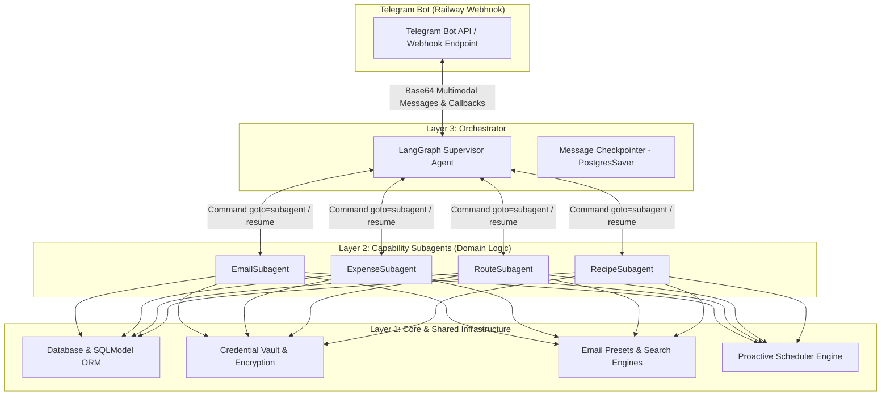

# Telegram Personal Assistant Bot — Complete Architecture Spec (RFC)

## 1. Overview & Architecture Scope

This document specifies the technical and functional architecture for a high-performance, single-user **Personal Assistant Telegram Bot** deployed on **Railway**, designed with built-in **multi-user extensibility** from day one. The assistant orchestrates diverse daily tasks—including email expense tracking, route planning, grocery/recipe management, and proactive reminders—through a **3-Layer Plugin Architecture** powered by **LangGraph multi-agent orchestration** and **Gemini Flash / Kimi k3 native multimodal inference**.

---

## 2. System Architecture & The 3-Layer Design Pattern

To prevent tool duplication and maintain strict modularity, the codebase is structured into three distinct architectural layers:



1. **Layer 1: Core (`core/`)** — Foundational infrastructure shared across all capabilities:
   - `core/db.py`: AsyncSQLModel + `asyncpg` PostgreSQL database engine and connection pool (`pool_size=5, max_overflow=10`).
   - `core/vault.py`: Symmetric authenticated encryption (`Fernet` / AES-256-GCM via `cryptography`) keyed by a Railway runtime `ENCRYPTION_KEY` for protecting OAuth tokens and API secrets.
   - `core/scheduler.py`: In-process `APScheduler` engine bound to FastAPI's official `lifespan` manager, configured with `misfire_grace_time=3600` and `coalesce=True`.
   - `core/shared_tools/`: Common utilities (date/time parser, location coordinate resolver, global email sender preset library).
2. **Layer 2: Capability Plugins (`capabilities/`)** — Self-contained domain modules:
   - `capabilities/email/`: Gmail OAuth 2.0 REST API integration, smart category queries, and email reading/drafting tools.
   - `capabilities/expenses/`: Pydantic expense extraction, merchant deduplication, and financial categorization.
   - `capabilities/routes/`: Transit and driving route planners.
   - `capabilities/recipes/`: Recipe scraping, ingredient parsing, and grocery list synchronization.
3. **Layer 3: Orchestration (`orchestrator/`)** — Top-level LangGraph multi-agent routing:
   - `orchestrator/supervisor.py`: Primary Supervisor agent delegating to domain subagents using `Command(goto=...)`.
   - `orchestrator/state.py`: Shared graph state (`AssistantState` extending `MessagesState` with `user_id`, `current_timezone`, and `active_domain`).

---

## 3. Database Schema & Multi-User Scoping (`SQLModel`)

All domain tables explicitly require a `user_id` foreign key referencing `UserProfile`. This ensures zero schema migrations are needed to support multiple users or multi-tenancy in the future.

```python
from datetime import datetime
from typing import List, Optional
from sqlmodel import SQLModel, Field, Column, JSON

class UserProfile(SQLModel, table=True):
    user_id: int = Field(primary_key=True)  # Telegram User ID
    telegram_chat_id: int = Field(index=True, unique=True)
    current_timezone: str = Field(default="UTC")
    home_currency: str = Field(default="USD")
    tracked_banks: List[str] = Field(default=[], sa_column=Column(JSON))
    created_at: datetime = Field(default_factory=datetime.utcnow)

class UserCredential(SQLModel, table=True):
    id: Optional[int] = Field(default=None, primary_key=True)
    user_id: int = Field(foreign_key="userprofile.user_id", index=True)
    provider: str = Field(index=True)  # e.g., "gmail"
    encrypted_token_payload: str       # Ciphertext encrypted via Fernet
    updated_at: datetime = Field(default_factory=datetime.utcnow)

class ExpenseTransaction(SQLModel, table=True):
    id: Optional[int] = Field(default=None, primary_key=True)
    user_id: int = Field(foreign_key="userprofile.user_id", index=True)
    amount: float
    currency: str
    merchant: str
    category: str
    date: datetime
    source_message_id: Optional[str] = Field(default=None, unique=True, index=True)
    is_verified: bool = Field(default=True)

class GroceryItem(SQLModel, table=True):
    id: Optional[int] = Field(default=None, primary_key=True)
    user_id: int = Field(foreign_key="userprofile.user_id", index=True)
    name: str
    quantity: str = Field(default="1")
    category: str = Field(default="General")
    is_purchased: bool = Field(default=False)
    added_at: datetime = Field(default_factory=datetime.utcnow)

class ScheduledJob(SQLModel, table=True):
    id: Optional[int] = Field(default=None, primary_key=True)
    user_id: int = Field(foreign_key="userprofile.user_id", index=True)
    job_name: str
    cron_expression: str
    instruction_prompt: str
    timezone: str = Field(default="UTC")
    is_active: bool = Field(default=True)
    created_at: datetime = Field(default_factory=datetime.utcnow)

class QualityAuditLog(SQLModel, table=True):
    id: Optional[int] = Field(default=None, primary_key=True)
    user_id: int = Field(foreign_key="userprofile.user_id", index=True)
    thread_id: str = Field(index=True)
    faithfulness_score: int = Field(ge=1, le=5)
    routing_efficiency_score: int = Field(ge=1, le=5)
    hallucination_detected: bool = Field(default=False, index=True)
    unnecessary_friction_flag: bool = Field(default=False)
    evidence_explanation: str
    evaluated_at: datetime = Field(default_factory=datetime.utcnow)
```

---

## 4. Multi-Agent Orchestration & Human-in-the-Loop Protocol

### 4.1 Subgraph Handoff via LangGraph `Command`
- The Supervisor routes tasks using graph-level handoffs:
  ```python
  return Command(goto="expense_subagent", update={"active_domain": "expenses"})
  ```
- Subagents execute domain tools and return `Command(goto="supervisor")` when completed.
- Persistent Telegram chats map to `thread_id = str(chat_id)` in `PostgresSaver`. When thread history exceeds ~20–30 messages, an automatic summarization hook compresses older turns into a concise `conversation_summary` string to keep prompts fast and token costs low.

### 4.2 Human-in-the-Loop (HITL) Telegram Callback Protocol
- When an action requires user confirmation (e.g., verifying an ambiguous expense or sending an email), the subagent calls LangGraph's native `interrupt(value={"type": "confirm_action", ...})`.
- The FastAPI webhook sends an interactive Telegram message with **1-tap Inline Keyboard buttons**:
  ```text
  ❓ Found an expense of $15.00. Was this at Starbucks?
  [✅ Confirm] [✏️ Edit] [❌ Ignore]
  ```
- Each button encodes a compact JSON action inside Telegram's 64-byte `callback_data` limit: `{"a": "confirm", "t": "123"}`.
- Upon receiving a `callback_query`, the webhook answers Telegram immediately and resumes the exact paused checkpoint statelessly:
  ```python
  await graph.ainvoke(
      Command(resume={"action": "confirm"}),
      config={"configurable": {"thread_id": str(chat_id)}}
  )
  ```

---

## 5. Email Capability & Zero-Friction Gmail Onboarding

### 5.1 Authentication & Scopes
- Authenticates via Google OAuth 2.0 with refresh tokens encrypted in `UserCredential`.
- Requires `gmail.readonly` (to search/read emails) and `gmail.modify` (to apply the `Assistant/Processed` label).

### 5.2 Zero-Friction Smart Query & Auto-Discovery
- **Default Query:** Catches 95%+ of bank alerts and merchant receipts out of the box without requiring manual user keyword entry:
  ```text
  (category:primary OR category:updates) 
  (subject:"receipt" OR subject:"transaction" OR subject:"charge" OR subject:"payment" OR subject:"order" OR "you paid" OR "amount due") 
  -label:Assistant/Processed newer_than:7d
  ```
- **Auto-Discovery:** When an expense is extracted from a new sender (e.g., `alerts@mybank.com`), the domain is automatically added to `user_profile.tracked_banks`.
- **2-Layer Deduplication:**
  1. Processed emails are tagged with Gmail label `-label:Assistant/Processed`.
  2. `ExpenseTransaction.source_message_id` is a `UNIQUE` index in PostgreSQL to prevent database insertion duplicates.

### 5.3 Extraction & Ambiguity Handling
- Extracted via a strict Pydantic `ExtractedExpense` schema with a `confidence` score (0.0 to 1.0) and `needs_clarification: bool`.
- If `confidence >= 0.8` and `not needs_clarification`: Logs silently and applies the Gmail processed label.
- If `confidence < 0.8`: Pauses execution and sends an interactive Telegram confirmation keyboard.

---

## 6. Proactive Scheduler & Dynamic Timezone Engine

### 6.1 The 5-Pillar Scheduler Guardrail System (Railway Reliability)
1. **Lifespan Binding:** `AsyncIOScheduler()` is initialized inside `@asynccontextmanager def lifespan(app: FastAPI):` so the scheduler loop is tied directly to Uvicorn's main asyncio event loop.
2. **1-Hour Misfire Grace:** Set `misfire_grace_time=3600` and `coalesce=True`. If Railway restarts or redeploys a container when a job was scheduled, it fires immediately upon booting.
3. **Deterministic Timezones:** Docker image installs `tzdata`. Every cron trigger is compiled with `ZoneInfo(job.timezone)`.
4. **Dual-Registration & Watchdog:** Writing a job saves to PostgreSQL `ScheduledJob` and registers in memory. A 60-second background watchdog reconciles Postgres rows with active Uvicorn memory.
5. **Instant Testing Tools:** Exposes `/jobs` (displays local timestamps for `next_run_time`) and `/run_now <job_id>` (fires any reminder on demand in 5 seconds).

### 6.2 Dynamic Timezone Adaptation & Travel Detection
- Central user timezone is stored as an IANA string (`user_profile.current_timezone`).
- **3 Automatic Update Mechanisms:**
  1. Conversational chat commands (*"I just landed in Tokyo, switch my timezone"*).
  2. Telegram Live Location or Location Pin coordinate resolution.
  3. Proactive flight arrival alerts from `EmailSubagent` itinerary scanning.
- When `current_timezone` changes, the scheduler watchdog automatically recalculates the `next_run_time` of every active job so reminders always trigger at the correct local time.

---

## 7. LLM-as-a-Judge Observability & Continuous Evaluation

To ensure continuous quality assurance, prevent hallucinations, and detect routing inefficiencies across multi-agent turns without impacting user chat latency, the system implements an asynchronous **LLM-as-a-Judge** evaluation engine.

### 7.1 Asynchronous Background Execution (Zero Chat Latency)
- **Zero Inline Overhead:** Live Telegram webhook turns never block on evaluation. All message histories and tool call traces are stored in PostgreSQL (`PostgresSaver`).
- **Sampled Audit Job:** A background job managed by `APScheduler` evaluates:
  - **100%** of turns where `confidence < 0.8` or where an interactive `confirm_action` keyboard was triggered.
  - **10%** random sample of routine single-hop conversation turns.

### 7.2 Pydantic Rubric & Scorecard (`EvalScorecard`)
- Evaluation is executed by a stronger reasoning model (e.g., Gemini 1.5 Pro / Claude 3.5 Sonnet) enforcing a strict Pydantic JSON schema:
  ```python
  from pydantic import BaseModel, Field

  class EvalScorecard(BaseModel):
      conversation_id: str
      faithfulness_score: int = Field(ge=1, le=5, description="1=Hallucinated details not in tool output, 5=100% faithful")
      routing_efficiency_score: int = Field(ge=1, le=5, description="1=Ping-ponging/redundant hops, 5=Direct single hop")
      hallucination_detected: bool
      unnecessary_friction_flag: bool = Field(description="True if bot asked for info already provided by user")
      evidence_explanation: str
  ```

### 7.3 Proactive Quality Alerting & Persistence
- Every completed scorecard is persisted to the PostgreSQL `QualityAuditLog` table.
- **Automated Anomaly Alerting:** If any audited turn results in `faithfulness_score <= 2` or `hallucination_detected == True`, the scheduler instantly pushes a Telegram alert to the admin notification channel with the `thread_id` and `evidence_explanation` for immediate inspection.

---

## 8. Wayfinder Map & Decision Tickets Reference

The complete decision log and journey index for this specification are recorded in:
- [map.md](file:///Users/benjaminwo/Documents/agent-learn/.scratch/telegram-assistant-bot/map.md)
- [01 - Core Supervisor & Capability Handoff Protocol](file:///Users/benjaminwo/Documents/agent-learn/.scratch/telegram-assistant-bot/issues/01-core-supervisor-protocol.md)
- [02 - Email Capability & Gmail API Integration](file:///Users/benjaminwo/Documents/agent-learn/.scratch/telegram-assistant-bot/issues/02-email-capability-and-gmail-api.md)
- [03 - Database Schema & Credential Encryption](file:///Users/benjaminwo/Documents/agent-learn/.scratch/telegram-assistant-bot/issues/03-database-schema-and-encryption.md)
- [04 - Multimodal Telegram Webhook & Inline Callback Architecture](file:///Users/benjaminwo/Documents/agent-learn/.scratch/telegram-assistant-bot/issues/04-multimodal-telegram-webhook.md)
- [05 - Proactive Scheduler & Dynamic Timezone Adaptation Protocol](file:///Users/benjaminwo/Documents/agent-learn/.scratch/telegram-assistant-bot/issues/05-proactive-scheduler-and-timezone.md)
